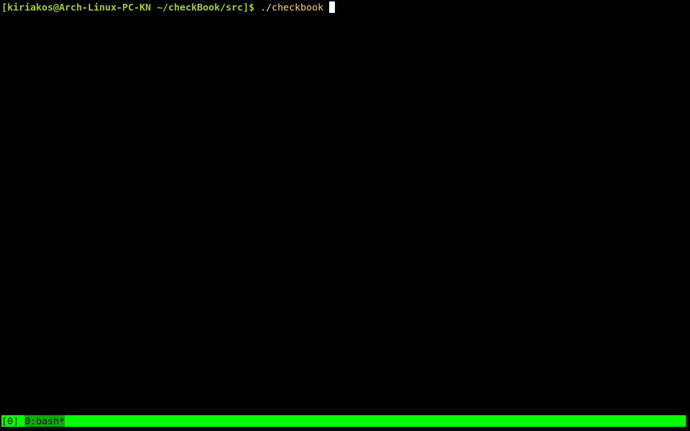

# checkBook

A project to keep track of bank checks

### Build and run
```
$ git clone https://github.com/KNaiskes/checkBook
$ cd checkBook/src/
$ make
$ ./checkBook
```

#### Available options
- Add new check in your list
- Remove a check from your list
- Update/Modify a check from your list
- List all your available checks


